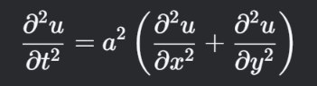
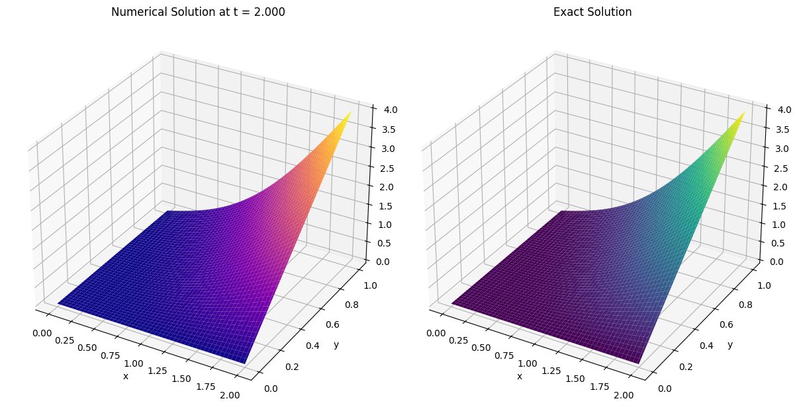
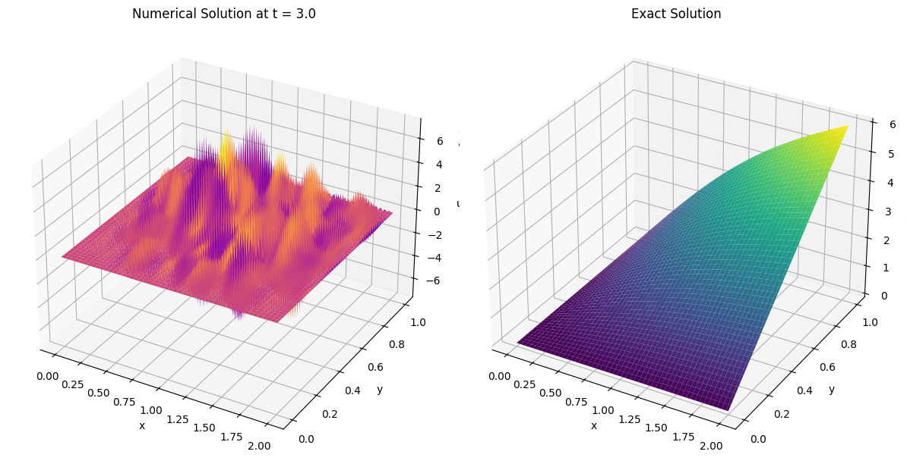

# numerical-2d-wave
Numerical Solution of 2D Wave Equation
# 🌊2D Wave Equation Solver

This repository contains two Python implementations for solving the 2D Wave Equation numerically using an Explicit Scheme.



## Features

- Solves the 2D wave equation: 
- User-defined parameters (simulation time, grid resolution)
- Stability check (CFL condition)
- 3D visualization of numerical vs exact solutions
- Error computation and visualization


## 📂Files

### 1️⃣`wave2d.py`
- Uses full time-history array storage
- Computes max error at final time
- Generates 3 plots:
- Numerical solution
- Exact solution
- Error distribution

### 2️⃣`wave2d_alt.py`
- Optimized memory usage (3-time-step storage)
- Enhanced input validation
- Computes both max and min error
- Same visualization as wave2d.py


# 📦Installation
Python 3.x
- numpy
- matplotlib 

```bash
pip install numpy matplotlib
```
### Required Libraries
This project requires:
- [NumPy](https://numpy.org/) (for numerical computations)
- [Matplotlib](https://matplotlib.org/) (for visualization)

### Installation Options

#### 1. Using pip (recommended)
```bash
pip install numpy matplotlib
```

## 📊 Output Visualization




